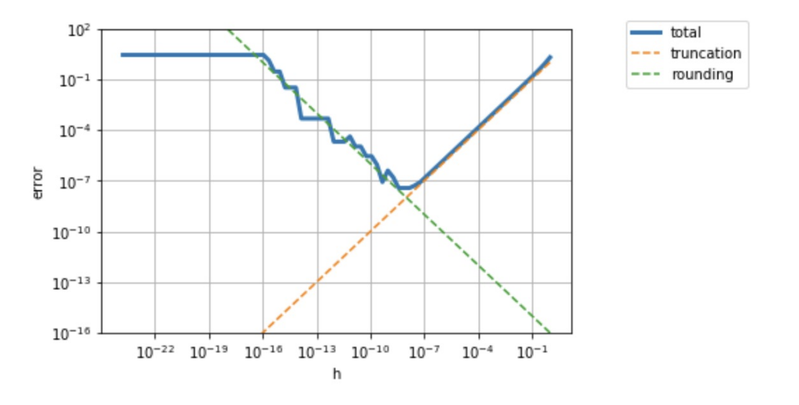

## Learning Objectives

* Approximate derivatives using the Finite Difference Method

## Finite Difference Approximation

#### Motivation

For a given smooth function \\(f(x)\\), we want to calculate the derivative \\(f'(x)\\) at a given value of \\(x\\).

However, sometimes we do not know how to compute the analytical expression \\(f'(x)\\) or it is computationally too expensive. 

Finite difference methods can help find an approximation for the value of \\(f'(x)\\).

#### Definition

For a differentiable function \\(f(x):\mathbb{R} \rightarrow \mathbb{R}\\), the derivative is defined as

\[f'(x) = \lim_{h \rightarrow 0} \frac{f(x+h)-f(x)}{h} \]

We define the forward finite difference approximation, \\(df(x)\\), to the first derivative as

\[f'(x) \approx df(x)  = \frac{f(x+h)-f(x)}{h} \]

where \\(h\\) is often called a "perturbation", i.e., a "small" change to the variable \\(x\\) (small when compared to the magnitude of \\(x\\)). 

By Taylor's theorem, we can write

\[f(x+h) = f(x) + f'(x)\, h + f''(x) \frac{h^2}{2}  + f'''(x) \frac{h^3}{6} + ... \]

\[f(x+h) =f(x) + f'(x)\, h + O(h^2) \]

\[f'(x) = \frac{f(x+h)-f(x)}{h} + O(h)  \]

Rearranging the above, we get the derivative \\(f'(x)\\) as a function of the forward finite difference approximation \\(df(x)\\):

\[f'(x) = df(x) + O(h)  \]

#### Error

Therefore, the truncation error of the forward finite difference approximation is bounded by:

\[Mh \geq |f'(x) - df(x)| \]

 where \\(M\\) is a constant bound on the value of \\(h\\).

If \\(h\\) is very small, we will have cancellation errors, which is bounded by:

\[\frac{\epsilon_m|f(x)|}{h} \geq df(x) \]

where \\(\epsilon_m\\) is machine epsilon.

To find the \\(h\\) that minimizes the total error:

\[error \approx \frac{\epsilon_m|f(x)|}{h} + Mh \]

\[h = \sqrt{\frac{\epsilon_m |f(x)|}{M}} \]

Using the forward finite different approximation on \\(f(x) = e^x - 2\\), we can see the values of total error, truncation error, and rounding error depending on the chosen perturbation \\(h\\) in the graph below.

Therefore, we can see that the optimal \\(h\\) that minimizes the total error is where the truncation error and rounding error intersect.

Using a similar approach, we can summarize the following finite difference approximations:

### Forward Finite Difference Method

$$df(x) = \frac{f(x+h)-f(x)}{h}$$

In addition to the computation of \\(f(x)\\), this method requires an extra cost of one function evaluation \\(f(x+h)\\) for a given perturbation, and has truncation order \\(O(h)\\).

#### Example

Assume \\(f(x) = 2x^2 + 15x + 1\\) and we are trying to find \\(df(x)\\) at \\(x = 10, h = 0.01\\).

\[f(x) = f(10) = 2 \times 10^2 + 15 \times 10+ 1 = 351 \]

\[f(x+h) = f(10+0.01) = 2 \times (10.01)^2 + 15 \times (10.01)+ 1 = 351.5502 \]

\[df(x) = df(10) = \frac {351.5502 - 351}{0.01} = 55.02 \]

We can find the absolute truncation error by:

\[f'(x) = 4x + 15, f'(10) = 55 \]

\[error = |f'(x) - df(x)| = |55 - 55.02| = 0.02 \]

### Backward Finite Difference Method

$$df(x) = \frac{f(x)-f(x-h)}{h}$$

In addition to the computation of \\(f(x)\\), this method requires and extra cost of one function evaluation \\(f(x-h)\\) for a given perturbation, and has truncation order \\(O(h) \\).

#### Example

Assume \\(f(x) = 2x^2 + 15x + 1\\) and we are trying to find \\(df(x)\\) at \\(x = 10, h = 0.01\\).

\[f(x) = f(10) = 2 \times 10^2 + 15 \times 10+ 1 = 351 \]

\[f(x-h) = f(10-0.01) = 2 \times (9.99)^2 + 15 \times (9.99)+ 1 = 350.4502 \]

\[df(x) = df(10) = \frac {351 - 350.4502}{0.01} = 54.98 \]

We can find the absolute truncation error by:

\[f'(x) = 4x + 15, f'(10) = 55 \]

\[error = |f'(x) - df(x)| = |55 - 54.98| = 0.02 \]

### Central Finite Difference Method

$$df(x) = \frac{f(x+h)-f(x-h)}{2h}$$

This method requires an extra cost of two function evaluations (\\(f(x+h)\\) and \\(f(x-h)\\) ) for a given perturbation, and has truncation order \\(O(h^2) \\). So, we can see that the Central Finite Difference approximation provides better accuracy with possible increased computational cost.

#### Example

Assume \\(f(x) = 2x^2 + 15x + 1\\) and we are trying to find \\(df(x)\\) at \\(x = 10, h = 0.01\\).

\[f(x+h) = f(10+0.01) = 2 \times (10.01)^2 + 15 \times (10.01)+ 1 = 351.5502 \]

\[f(x-h) = f(10-0.01) = 2 \times (9.99)^2 + 15 \times (9.99)+ 1 = 350.4502 \]

\[df(x) = df(10) = \frac {351.5502 - 350.4502}{2 \times 0.01} = 55.0 \]

We can find the absolute truncation error by:

\[f'(x) = 4x + 15, f'(10) = 55 \]

\[error = |f'(x) - df(x)| = |55 - 55| = 0.0\]

### Gradient Approximation

Consider a differentiable function \\(f(x_1, \dots, x_n):\mathbb{R^n} \rightarrow \mathbb{R}\\), where the derivative is defined as the gradient, or

\[\nabla f(x) = \begin{bmatrix}
           \frac{\partial f}{\partial x_1} \\
           \frac{\partial f}{\partial x_2} \\
           \vdots \\
           \frac{\partial f}{\partial x_n}
         \end{bmatrix} \]

We define the gradient finite difference approximation as

\[\nabla_{FD} f(x) = \begin{bmatrix}
          df(x_1) \\
           df(x_2) \\
           \vdots \\
           df(x_n)
         \end{bmatrix}  = \begin{bmatrix}
          \frac{f(x+h \delta_1) - f(x)}{h} \\
           \frac{f(x+h \delta_2) - f(x)}{h} \\
           \vdots \\
           \frac{f(x+h \delta_n) - f(x)}{h}
         \end{bmatrix}\]

using the forward finite difference method, where \\(\delta_i \\) is a vector with a \\(1\\) at position \\(i\\) and \\(0\\) elsewhere. 

Note: \\(df(x) \\) can be defined using any finite difference method.

#### Example

Assume \\(f(x_1, x_2) = 2x_1 + x_1^2x_2 + x_2^3\\) and we are trying to find the forward finite difference gradient approximation at \\(x_1 = 1.3, x_2 = 4.9\\) when \\(h = 0.05\\).

\[\nabla_{FD} f(x) = \begin{bmatrix}
           df(x_1) \\
           df(x_2)
         \end{bmatrix} = \begin{bmatrix}
           14.985 \\
           74.4575
         \end{bmatrix} \]

\[\ df(x_1) = \frac{f(x_1 + h, x_2) - f(x_1, x_2)}{h} = \frac{f(1.3 + 0.05, 4.9) - f(1.3, 4.9)}{0.05}  = 14.985 \]

\[\ df(x_2) = \frac{f(x_1, x_2 + h) - f(x_1, x_2)}{h} = \frac{f(1.3, 4.9 + 0.05) - f(1.3, 4.9)}{0.05} = 74.4575 \]

We can find the absolute truncation error by:

\[\nabla f(x) = \begin{bmatrix}
           \frac{\partial f}{\partial x_1} \\
           \frac{\partial f}{\partial x_2}
         \end{bmatrix} = \begin{bmatrix}
           2 x_1 x_2 + 2 \\
           x_1^2 + 3 x_2^2
         \end{bmatrix} \ = \begin{bmatrix}
           14.74 \\
           73.72
         \end{bmatrix} \]

\[error = |\nabla f(x) - \nabla_{FD} f(x)| = \begin{bmatrix}
         |14.985 - 14.74| \\
          | 74.4575 - 73.72|
         \end{bmatrix} \ = \begin{bmatrix}
         .245 \\
          .7375
         \end{bmatrix} \ \]

### Jacobian Approximation

Consider a differentiable function \\(f = \begin{bmatrix}
           f_1(x) &
           f_2(x) &
           \dots &
           f_n(x)
         \end{bmatrix}:\mathbb{R^n} \rightarrow \mathbb{R^m}\\), where the derivative is defined as the Jacobian matrix, or

\[\mathbb{J}(x) = \begin{bmatrix}
           \frac{\partial f_1}{\partial x_1} & \frac{\partial f_1}{\partial x_2} & \dots & \frac{\partial f_1}{\partial x_n}\\
           \frac{\partial f_2}{\partial x_1} & \frac{\partial f_2}{\partial x_2} & \dots & \frac{\partial f_2}{\partial x_n} \\
           & \ddots \\
           \frac{\partial f_m}{\partial x_1} & \frac{\partial f_m}{\partial x_2} & \dots & \frac{\partial f_m}{\partial x_n}
         \end{bmatrix} \]

We define the Jacobian finite difference approximation as

\[\mathbb{J_{FD}}(x) = \begin{bmatrix}
           df_1(x_1) & df_1(x_2) & \dots & df_1(x_n)\\
           df_2(x_1) & df_2(x_2) & \dots & df_2(x_n) \\
           & \ddots \\
           df_m(x_1) & df_m(x_2) & \dots & df_m(x_n)
         \end{bmatrix} \]

where \\(df_i(x_j) \\) is the approximation of \\(f_i\\) at \\(x_j\\) using any finite difference method.

#### Example

Assume \\(f = \begin{bmatrix}
           f_1(x) = 2x_1^2 + 6x_1x_2 &
           f_2(x) = 3x_1 + 7x_2
         \end{bmatrix}\\) and we are trying to find the forward finite difference gradient approximation at \\(x_1 = 3, x_2 = 7\\) when \\(h = 0.1\\).

\[\nabla_{FD} f(x) = \begin{bmatrix}
           df_1(x_1) && df_1(x_2) \\
           df_2(x_1) && df_2(x_2)
         \end{bmatrix} = \begin{bmatrix}
           54.2 && 18 \\
           3 && 7
         \end{bmatrix} \]

\[\ df_1(x_1) = \frac{f_1(x_1 + h, x_2) - f_1(x_1, x_2)}{h} = \frac{f_1(3 + 0.1, 7) - f_1(3, 7)}{0.1}  = 54.2 \]

\[\ df_1(x_2) = \frac{f_1(x_1, x_2 + h) - f_1(x_1, x_2)}{h} = \frac{f_1(3, 7 + 0.1) - f_1(3, 7)}{0.1} = 18 \]

\[\ df_2(x_1) = \frac{f_2(x_1 + h, x_2) - f_2(x_1, x_2)}{h} = \frac{f_2(3 + 0.1, 7) - f_2(3, 7)}{0.1}  = 3 \]

\[\ df_2(x_2) = \frac{f_2(x_1, x_2 + h) - f_2(x_1, x_2)}{h} = \frac{f_2(3, 7 + 0.1) - f_2(3, 7)}{0.1} = 7 \]

We can find the absolute truncation error by:

\[\nabla f(x) = \begin{bmatrix}
            \frac{\partial f_1}{\partial x_1} & \frac{\partial f_1}{\partial x_2} \\
            \frac{\partial f_2}{\partial x_1} & \frac{\partial f_2}{\partial x_2}
         \end{bmatrix} = \begin{bmatrix}
           4 x_1 + 6 x_2 & 6 x_1 \\
           3 & 7
         \end{bmatrix} \ = \begin{bmatrix}
           54 & 18 \\
           3 & 7
         \end{bmatrix} \]

\[error = |\nabla f(x) - \nabla_{FD} f(x)| = \begin{bmatrix}
         |54.2 - 54| & | 18 - 18| \\
          | 3 - 3| & |7-7|
         \end{bmatrix} \ = \begin{bmatrix}
         0.2 & 0.0 \\
          0.0 & 0.0
         \end{bmatrix} \ \]

*Reference text: "Scientific Computing: an introductory survey" by Michael Heath*

## Review Questions

1. What is the general form of a Taylor series?

2. How do you use a Taylor series to approximate a function at a given point?

3. How can you approximate the derivative of a function using Taylor series?

4. How can you approximate the integral of a function using Taylor series?

5. Given an function and a center, can you write out the \\(n\\)-th degree Taylor polynomial?

6. For an \\(n\\)-th degree Taylor polynomial, what is the bound on the error of your approximation as a function of distance from the center?

7. For simple functions, can you find the constant \\(C\\) in the Taylor error bound?

8. Be able to determine how many terms are required for a Taylor series approximation to have less than some given error.
