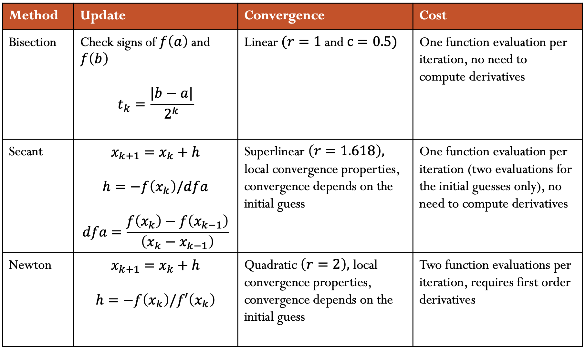

# Solving Nonlinear Equations

* * *

## Learning objectives

- Evaluate the bisection, newton, and secant methods to solve nonlinear equations in 1D
- Apply Newton's method to solve a nonlinear system of equations

## Root of a Function

Consider a function $$f : \mathbb{R} \to \mathbb{R}$$. The point $$x \in \mathbb{R}$$
is called the **_root_** of $$f$$ if $$f(x) = 0$$.

## Solution of an Equation

Finding the values of $$x$$ for which $$f(x) = 0$$ is useful for many applications,
but a more general task is to find the values of $$x$$ for which $$f(x) = y$$. The
same techniques used to find the root of a function can be used to solve an
equation by manipulating the function like so:

$$\tilde{f}(x) = f(x) - y = 0$$

The new function $$\tilde{f}(x)$$ has a root at the solution to the original equation $$f(x) = y$$.

## Nonlinear Equations in 1D

Linear functions are trivial to solve, as are quadratic functions if you have
the quadratic formula memorized. However, polynomials of higher degree and
non-polynomial functions are much more difficult to solve. The simplest technique
for solving these types of equations is to use an iterative root-finding technique.
Instead of finding out where $$f(x) = 0$$ directly, we will start with an initial guess
and improve it over multiple steps until our _residual_ $$f(x)$$ is sufficiently small.

### Convergence

An iterative method converges with rate $$\mathbf r$$ if:

$$\lim_{k\to\infty} \frac{\|e_{k + 1}\|}{\|e_{k}\|^{\mathbf r}} = C, \quad 0 < C < \infty$$

where $$e_k$$ is the error at iteration k.

$$\begin{eqnarray}
\mathbf{r} &=& 1: linear\ convergence\\
\\
1 < \mathbf{r} &<& 2: superlinear\ convergence\\
\\
\mathbf{r} &=& 2: quadratic\ convergence\\
\end{eqnarray}$$ 

**Linear convergence** gains a constant number of accurate digits each step (the error shrinks linearly). 
When $$C$$ is close to 1 convergence is slow.

**Quadratic convergence** doubles the number of accurate digits in each step (the error shrinks quadratically). However it only starts making sense once $$\|e^k\|$$ is small, and C does not matter much.

#### Example

What is the convergence rate of **Power Iteration**?

    
<strong>Answer</strong>

Recall from the power iteration method

$$\lim_{k\to\infty} \frac{\|e_{k + 1}\|}{\|e_{k}\|^{\mathbf 1}} = |\frac{\lambda_{2}} {\lambda_{1}}| = C$$

We see that when <strong>r</strong> = 1, we get a constant for the ratio between two consecutive iterations. Therefore power iteration has linear convergence.

### Bisection Method

The bisection method is the simplest root-finding technique.

#### Algorithm

The algorithm for bisection is analogous to binary search:

1. Take two points, $$a$$ and $$b$$, on each side of the root such that
   $$f(a)$$ and $$f(b)$$ have opposite signs.
2. Calculate the midpoint $$c = \frac{a + b}{2}$$
3. Evaluate $$f(c)$$ and use $$c$$ to replace either $$a$$ or $$b$$, keeping the signs
   of the endpoints opposite.

With this algorithm we successively half the length of the interval known to
contain the root each time.  We can repeat this process until the length of the
interval is less than the tolerance to which we want to know the root.

#### Convergence

The bisection method does not estimate $$x_{k}$$, the approximation of the desired root $$x$$. It instead finds an interval (smaller than a given tolerance), that contains the root.

Therefore, the error at iteration k is defined to be the length of the interval at k iterations or $$\frac{(b - a)}{2^k} $$.

$$\lim_{k\to\infty} \frac{\|e_{k + 1}\|}{\|e_{k}\|^{\mathbf r}} = \lim_{k\to\infty} \frac{\|\frac{(b - a)}{2^{k + 1}}\|}{\|\frac{(b - a)}{2^k}\|}  = 0.5$$

Which gives us linear convergence, with a constant of $$\frac{1}{2}$$.

#### Computational Cost

Conceptually bisection method uses 2 function evaluations
at each iteration.  However, at each step either one of $$a$$ or $$b$$ stays the
same.  So, at each iteration (after the first iteration), one of $$f(a)$$ or
$$f(b)$$ was computed during the previous iteration.  Therefore,
bisection method requires only one new function evaluation per iteration.
Depending on how costly the function is to evaluate, this can be a significant
cost savings.

#### Drawbacks

The bisection method requires us to know a little about our function.
Specifically, $$f(x)$$ must be continuous and we must have an interval
$$[a, b]$$ such that

$$\mathrm{sgn}(f(a)) = -\mathrm{sgn}(f(b)).$$

Then, by the intermediate value theorem, we know that there must be a
root in the interval $$[a,b]$$.

This restriction means that the bisection method cannot solve for the root of
$$x^2$$, as it never crosses the x-axis and becomes negative.

#### Example

$$f(x) = x^3 - x - 1$$

    
<strong>Answer</strong>

  

From the graph above, we can see that the function has a root somewhere between 1 and 2.
It is difficult to tell exactly what the root is, but we can use the bisection
method to approximate it. Specifically, we can set 
$$\begin{flalign*}
a = 1\\
b = 2
\end{flalign*}$$

 
 
<strong> Iteration 1 </strong>

$$\begin{flalign*}
&a = 1 \hspace{7.0cm} f(a) = f(1) = 1^3 - 1 - 1 = -1 &\\
&b = 2 \hspace{7.02cm} f(b) = f(2) = 2^3 - 2 - 1 = 5 & \\
&c = \frac{a + b}{2} = \frac{3}{2} = 1.5 \hspace{3.67cm} f(c) = f(1.5) = 1.5^3 - 1.5 - 1 = 0.875&
\end{flalign*}$$

Since f(b) and f(c) are both positive, we will replace b with c and
further narrow our interval.

 
 
<strong> Iteration 2 </strong>

$$\begin{flalign*}
&\hspace{0.4cm}a = 1 \hspace{6.5cm} f(a) = f(1) = -1&\\
&\hspace{0.4cm}b = 1.5 \hspace{6.2cm} f(b) = f(1.5)  = 0.875&\\
&\hspace{0.4cm}c = \frac{a + b}{2} = \frac{2.5}{2} = 1.25 \hspace{2.5cm} f(c) = f(1.25) = 1.25^3 - 1.25 - 1 = -0.296875&
\end{flalign*}$$

Since f(a) and f(c) are both negative, we will replace a with c and
further narrow our interval.

Note that as described above, we didn't need to recalculate f(a) or f(b)
as we had already calculated them during the previous iteration.
Reusing these values can be a significant cost savings.

 
 
<strong> Iteration 3 </strong>

$$\begin{flalign*}
&\hspace{0.4cm}a = 1.25 \hspace{6.0cm} f(a) = f(1.25)  = -0.296875&\\
&\hspace{0.4cm}b = 1.5 \hspace{6.25cm} f(b) = f(1.5)   = 0.875&\\
&\hspace{0.4cm}c = \frac{a + b}{2} = \frac{1.25 + 1.5}{2} = 1.375 \hspace{0.9cm} f(c) = f(1.375) = 1.375^3 - 1.375 - 1 = 0.224609375&
\end{flalign*}$$

Since f(b) and f(c) are both positive, we will replace b with c and
further narrow our interval. 

 
<strong>...</strong>
 
 
<strong> Iteration n </strong>
 
 
When running the code for bisection method given below, the resulting
approximate root determined is 1.324717957244502.  With bisection,
we can approximate the root to a desired tolerance (the value above is
for the default tolerances).
 
  <strong> Code </strong>  

The following Python code calls SciPy's <code>bisect</code> method:

<pre><code>
import scipy.optimize as opt

def f(x):
    return x**3 - x - 1

root = opt.bisect(f, a=1, b=2)
</code></pre>

### Newton's Method

The Newton-Raphson Method (a.k.a. Newton's Method) uses a Taylor series
approximation of the function to find an approximate solution.
Specifically, it takes the first 2
terms:

$$f(x_k + h) \approx f(x_k) + f'(x_k)h$$

#### Algorithm

Starting with the Taylor series above, we can find the root of this new
function like so:

$$f(x_k) + f'(x_k)h = 0$$

$$h = - \frac{f(x_k)}{f'(x_k)}$$

This value of $$h$$ is known as the **Newton step**. Now, $$h$$ can be used to perform a **Newton update**, to find a value of $$x$$ closer to the root of $$f$$:

$$\begin{eqnarray}
x_{k+1} &=& x_k + h \\
&=& x_k - \frac{f(x_k)}{f'(x_k)}
\end{eqnarray}$$

Geometrically, $$(x_{k+1}, 0)$$ is the intersection of the x-axis and the
tangent of the graph at $$(x_k, f(x_k))$$.

By repeating this procedure, we can get closer and closer to
the actual root.

#### Computational Cost

With Newton's method, at each iteration we must evaluate
both $$f(x)$$ and $$f'(x)$$.

#### Convergence

Although Newton's method is more costly than the bisection method, it converges quicker.

$$\lim_{k\to\infty} \frac{\|e_{k + 1}\|}{\|e_{k}\|^{\mathbf 2}} = C$$

Which gives us quadratic convergence. However, as we see in the next section, this can depend on the initial guess.

#### Drawbacks

The additional cost of evaluating the derivative makes each iteration slower to compute.

Many functions are not easily differentiable, so Newton's Method is not always possible.  Even in cases when it is possible to evaluate the derivative, it may be quite costly.

Convergence only works well if you are already close to the root. Specifically, if started too far from the root Newton's method may not converge at all.

#### Example

$$\begin{align*}
f(x)  &= x^3 - x - 1 \\
f'(x) &= 3x^2 - 1
\end{align*}$$

    
<strong>Answer</strong>

  

From the graph above, we can see that the root is somewhere near
$$x = 1.$$ We will use x0 as our starting position.

 
 
<strong> Iteration 1 </strong>

$$\begin{flalign*}
\hspace{2cm} x_1 &= x_0 - \frac{f(x_0)}{f'(x_0)} \\
    &= 1   - \frac{f(1)}{f'(1)} &\\
    &= 1   - \frac{1^3 - 1 - 1}{3 \cdot 1^2 - 1} \\
    &= 1   + \frac{1}{2} \\
    &= 1.5
\end{flalign*}$$
 
 
<strong> Iteration 2 </strong>

$$\begin{flalign*}
\hspace{2cm} x_2 &= x_1 - \frac{f(x_1)}{f'(x_1)} \\
    &= 1.5 - \frac{f(1.5)}{f'(1.5)} &\\
    &= 1.5 - \frac{1.5^3 - 1.5 - 1}{3 \cdot 1.5^2 - 1} \\
    &= 1.5 - \frac{0.875}{5.75} \\
    &= 1.3478260869565217
\end{flalign*}$$
 
 
<strong> Iteration 3 </strong>

$$\begin{flalign*}
\hspace{2cm} x_3 &= x_2 - \frac{f(x_2)}{f'(x_2)} \\
    &= 1.3478260869565217 - \frac{f(1.3478260869565217)}{f'(1.3478260869565217)}& \\
    &= 1.3478260869565217 - \frac{1.3478260869565217^3 - 1.3478260869565217 - 1}{3 \cdot 1.3478260869565217^2 - 1} \\
    &= 1.3478260869565217 - \frac{0.10068217309114824}{4.449905482041588} \\
    &= 1.325200398950907
\end{flalign*}$$

As you can see, Newton's Method is already converging significantly
faster than the Bisection Method.
 
 
<strong>...</strong>
 
 
<strong> Iteration n </strong>
 
 
When running the code for Newton's method given below, the resulting
approximate root determined is 1.324717957244746.
 
 
<strong> Code </strong>  

The following Python code calls SciPy's <code>newton</code> method:

<pre><code>
import scipy.optimize as opt

def f(x):
    return x**3 - x - 1

def fprime(x):
    return 3 * x**2 - 1

root = opt.newton(f, x0=1, fprime=fprime)
</code></pre>

### Secant Method

Like Newton's Method, secant method uses the Taylor Series to find the
solution. However, you may not always be able to take the derivative of a
function. Secant method gets around this by approximating the derivative
as:

$$f'(x_k) \approx \frac{f(x_k) - f(x_{k-1})}{x_k - x_{k-1}}$$

#### Algorithm

The steps involved in the Secant Method are identical to those of the
Newton Method, with the derivative replaced by an approximation for the
slope of the tangent.

#### Computational Cost

Similar to bisection, although secant method conceptually requires
2 function evaluations per iteration, one of the function evaluations
will have been computed in the previous iteration and can be reused.
So, secant method requires 1 new function evaluation per iteration
(after the first iteration).

#### Convergence

Secant method has superlinear convergence.

More specifically, the rate of convergence $$r$$ is:

$$r = \frac{1 + \sqrt{5}}{2} \approx 1.618$$

This happens to be the golden ratio.

#### Drawbacks

This technique has many of the same drawbacks as Newton's Method, but
does not require a derivative. It does not converge as quickly as
Newton's Method. It also requires two starting guesses near the root.

#### Example

$$f(x) = x^3 - x - 1$$

    
<strong>Answer</strong>

  

Let's start with 
$$x_0 = 1$$ 
$$x_{-1} = 2$$

 
<strong> Iteration 1 </strong>
 
 
First, find an approximate for the derivative (slope):

$$\begin{flalign*}
\hspace{2cm}f'(x_0) &\approx \frac{f(x_0) - f(x_{-1})}{x_0 - x_{-1}} \\
    &= \frac{f(1) - f(2)}{1 - 2} &\\
    &= \frac{(1^3 - 1 - 1) - (2^3 - 2 - 1)}{1 - 2} \\
    &= \frac{(-1) - (5)}{1 - 2} \\
    &= 6
\end{flalign*}$$

Then, use this for Newton's Method:

$$\begin{flalign*}
\hspace{2cm}x_1 &= x_0 - \frac{f(x_0)}{f'(x_0)} \\
    &= 1   - \frac{f(1)}{f'(1)} &\\
    &= 1   - \frac{1^3 - 1 - 1}{6} \\
    &= 1   + \frac{1}{6} \\
    &= 1.1666666666666667
\end{flalign*}$$
 
 
<strong> Iteration 2 </strong>

$$\begin{flalign*}
\hspace{2cm}f'(x_1) &\approx \frac{f(x_1) - f(x_0)}{x_1 - x_0} \\
    &= \frac{f(1.1666666666666667) - f(1)}{1.1666666666666667 - 1} &\\
    &= \frac{(1.1666666666666667^3 - 1.1666666666666667 - 1) - (1^3 - 1 - 1)}{1.1666666666666667 - 1} \\
    &= \frac{(-0.5787037037037035) - (-1)}{1.1666666666666667 - 1} \\
    &= 2.5277777777777777
\end{flalign*}$$

$$\begin{flalign*}
\hspace{2cm}x_2 &= x_1 - \frac{f(x_1)}{f'(x_1)} \\
    &= 1.1666666666666667 - \frac{f(1.1666666666666667)}{f'(1.1666666666666667)} &\\
    &= 1.1666666666666667 - \frac{1.1666666666666667^3 - 1.1666666666666667 - 1}{2.5277777777777777} \\
    &= 1.1666666666666667 - \frac{-0.5787037037037035}{2.5277777777777777} \\
    &= 1.3956043956043955
\end{flalign*}$$
 
 
<strong> Iteration 3 </strong>

$$\begin{flalign*}
\hspace{2cm}f'(x_2) &\approx \frac{f(x_2) - f(x_1)}{x_2 - x_1} \\
    &= \frac{f(1.3956043956043955) - f(1.1666666666666667)}{1.3956043956043955 - 1.1666666666666667} &\\
    &= \frac{(1.3956043956043955^3 - 1.3956043956043955 - 1) - (1.1666666666666667^3 - 1.1666666666666667 - 1)}{1.3956043956043955 - 1.1666666666666667} \\
    &= \frac{(0.3226305152401032) - (-0.5787037037037035)}{1.3956043956043955 - 1.1666666666666667} \\
    &= 3.9370278683465503
\end{flalign*}$$

$$\begin{flalign*}
\hspace{2cm}x_3 &= x_2 - \frac{f(x_2)}{f'(x_2)} \\
    &= 1.3956043956043955 - \frac{f(1.3956043956043955)}{f'(1.3956043956043955)} &\\
    &= 1.3956043956043955 - \frac{1.3956043956043955^3 - 1.3956043956043955 - 1}{3.9370278683465503} \\
    &= 1.3956043956043955 - \frac{0.3226305152401032}{3.9370278683465503} \\
    &= 1.3136566609098987
\end{flalign*}$$

 
<strong>...</strong>
 
 
<strong> Iteration n </strong>
 
 
When running the code for secant method given below, the resulting
approximate root determined is 1.324717957244753.

 
 
<strong> Code </strong>
 
 
SciPy's <code>newton</code> method serves double-duty. If given a function f and a
first derivative f', it will use Newton's Method. If it is not given a
derivative, it will instead use the Secant Method to approximate it:

<pre><code>
import scipy.optimize as opt

def f(x):
    return x**3 - x - 1

root = opt.newton(f, x0=1)
</code></pre>

### 1D Summary

## Nonlinear System of Equations

Similar to root-finding in 1 dimension, we can also perform root-finding
for multiple equations in $$n$$ dimensions. Mathematically, we are trying to
solve $$\boldsymbol{f(x) = 0}$$ for $$\boldsymbol{f} : \mathbb{R}^n \to
\mathbb{R}^n$$. In other words, $$\boldsymbol{f(x)}$$ is now a vector-valued
function

$$\boldsymbol{f(x)} = \begin{bmatrix}
f_1(\boldsymbol{x}) \\
\vdots \\
f_n(\boldsymbol{x})
\end{bmatrix} = \begin{bmatrix}
f_1(x_1, \ldots, x_n) \\
\vdots \\
f_n(x_1, \ldots, x_n)
\end{bmatrix}$$

If we are instead looking for the solution to $$\boldsymbol{f(x) = y}$$, we can
rework our function like so:

$$\boldsymbol{\tilde{f}(x)} = \boldsymbol{f(x)} - \boldsymbol{y}
= \boldsymbol{0}$$

We can think of each equation as a function that describes a surface.
We are looking for vectors that describe the intersection of these
surfaces.

### The Jacobian Matrix

Given $$\boldsymbol{f} : \mathbb{R}^n \to \mathbb{R}^n$$ we define the Jacobian matrix $${\bf J}_f$$ as:

$${\bf J}_f(\boldsymbol{x}) = \begin{bmatrix}
\frac{\partial f_1}{\partial x_1} & \ldots & \frac{\partial f_1}{\partial x_n} \\
\vdots                            & \ddots & \vdots                            \\
\frac{\partial f_n}{\partial x_1} & \ldots & \frac{\partial f_n}{\partial x_n}
\end{bmatrix}$$

### Newton's Method

The multi-dimensional equivalent of Newton's Method involves approximating
a function as:

$$\boldsymbol{f(x + s)} \approx \boldsymbol{f(x)} + {\bf J}_f(\boldsymbol{x})\boldsymbol{s}$$

where $${\bf J}_f$$ is the **_Jacobian matrix_** of $$\boldsymbol{f}$$.

By setting this to $$\mathbf{0}$$ and rearranging, we get:

$$\begin{align*}
{\bf J}_f(\boldsymbol{x})\boldsymbol{s} &= -\boldsymbol{f(x)} \qquad \qquad (1) \\
\boldsymbol{s} &= - {\bf J}_f(\boldsymbol{x})^{-1} \boldsymbol{f(x)}
\end{align*}$$

Note that in practice we would not actually invert the Jacobian, but would
instead solve the linear system in $$(1)$$ to determine the step.

#### Algorithm

Similar to the way we solved for $$x_{k+1}$$ in 1 dimension, we can solve for:

$$\boldsymbol{x_{k+1}} = \boldsymbol{x_k} + \boldsymbol{s_k}$$
where $$\boldsymbol{s_k}$$
is determined by solving the linear system
$${\bf J}_f(\boldsymbol{x_k})\boldsymbol{s_k} = -\boldsymbol{f(x_k)}.$$

#### Drawbacks

Just like in 1D, Newton's Method only converges locally. It may also be
expensive to compute $${\bf J}_f$$ at each iteration and we must solve a linear
system at each iteration.

#### Example

Find a root for

$$\boldsymbol{f}(x, y) = \begin{bmatrix}
x + 2y - 2 \\
x^2 + 4y^2 - 4
\end{bmatrix}$$

    
<strong>Answer</strong>

The corresponding Jacobian and inverse Jacobian are:

$${\bf J}_f(\boldsymbol{x}) = \begin{bmatrix}
1  & 2 \\
2x & 8y
\end{bmatrix}$$

$${\bf J}_f^{-1} = \frac{1}{x - 2y} \begin{bmatrix}
-2y & \frac{1}{2} \\
\frac{x}{2} & - \frac{1}{4}
\end{bmatrix}$$

In this example, as the Jacobian is a 2 x 2 matrix with
a simple inverse, we work explicitly with the inverse, even though
we would not explicitly compute the inverse for a real problem.

Let's start at $$\boldsymbol{x_0} = \begin{bmatrix}1 \\ 1\end{bmatrix}$$.
 
 
<strong> Iteration 1 </strong>

$$\begin{flalign*}
\hspace{2cm}\boldsymbol{x_1} &= \boldsymbol{x_0} - {\bf J}_f(\boldsymbol{x_0})^{-1} \boldsymbol{f(x_0)} \\
    &= \begin{bmatrix}1 \\ 1\end{bmatrix}
        - \frac{1}{1 - 2}\begin{bmatrix}-2 & \frac{1}{2} \\ \frac{1}{2} & - \frac{1}{4}\end{bmatrix}
        \begin{bmatrix}1 \\ 1\end{bmatrix} &\\
    &= \begin{bmatrix}1 \\ 1\end{bmatrix} + \begin{bmatrix}-1.5 \\ 0.25\end{bmatrix} \\
    &= \begin{bmatrix}-0.5 \\ 1.25\end{bmatrix}
\end{flalign*}$$
 
 
<strong> Iteration 2 </strong>

$$\begin{flalign*}
\hspace{2cm}\boldsymbol{x_2} &= \boldsymbol{x_1} - {\bf J}_f(\boldsymbol{x_1})^{-1} \boldsymbol{f(x_1)} \\
    &= \begin{bmatrix}-0.5 \\ 1.25\end{bmatrix}
        - \frac{1}{-0.5 - 2.5}\begin{bmatrix}-2.5 & \frac{1}{2} \\ - \frac{1}{4} & - \frac{1}{4}\end{bmatrix}
        \begin{bmatrix}0 \\ 2.5\end{bmatrix} &\\
    &= \begin{bmatrix}-0.5 \\ 1.25\end{bmatrix} + \frac{1}{3}\begin{bmatrix}1.25 \\ -0.625\end{bmatrix} \\
    &= \begin{bmatrix}-0.08333333 \\ 1.04166667\end{bmatrix}
\end{flalign*}$$
 
 
<strong> Iteration 3 </strong>

$$\begin{flalign*}
\hspace{2cm}\boldsymbol{x_3} &= \boldsymbol{x_2} - {\bf J}_f(\boldsymbol{x_2})^{-1} \boldsymbol{f(x_2)} \\
    &= \begin{bmatrix}-0.08333333 \\ 1.04166667\end{bmatrix}
        - \frac{1}{-0.08333333 - 2.08333334}\begin{bmatrix}-2.08333334 & 0.5 \\ -0.041666665 & -0.25\end{bmatrix}
        \begin{bmatrix}9.99999993922529 \cdot 10^{-9} \\ 0.34722224944444413\end{bmatrix} &\\
    &= \begin{bmatrix}-0.08333333 \\ 1.04166667\end{bmatrix}
        + \frac{1}{2.1666666699999997}\begin{bmatrix}0.1736111 \\ -0.08680556\end{bmatrix} \\
    &= \begin{bmatrix}-0.00320513 \\ 1.00160256\end{bmatrix}
\end{flalign*}$$

 
<strong>...</strong>
 
 
<strong> Iteration n </strong>
 
 

 
 
<strong> Code </strong>
 
 
When running the code for Newton's method given below, the resulting
approximate root determined is
$$\begin{bmatrix}-2.74060567 \cdot 10^{-16} & 1\end{bmatrix}^\top.$$

<pre><code>
import numpy as np
import scipy.optimize as opt

def f(xvec):
    x, y = xvec
    return np.array([
        x + 2*y - 2,
        x**2 + 4*y**2 - 4
    ])

def Jf(xvec):
    x, y = xvec
    return np.array([
        [1, 2],
        [2*x, 8*y]
    ])

sol = opt.root(f, x0=[1, 1], jac=Jf)
root = sol.x
</code></pre>

## Review Questions

- See this [review link](/cs357/fa2020/reviews/rev-14-solve_nd.html)

