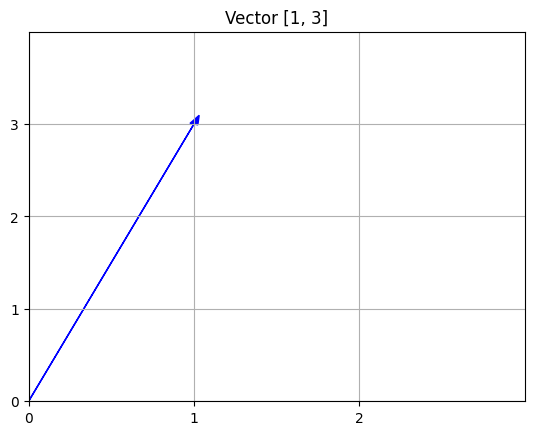

# Vectors, matrices, and norms

* * *

## Learning Objectives
You will be able to
* Understand vector spaces
* Identify linear transformations
* Recognize special matrices
* Perform matrix-vector multiplications
* Represent linear transformations as matrices
* Evaluate the magnitudes of vectors and matrices

## Vectors and Vector Spaces

### Vectors

A **_vector_** is an array of numbers that represent a magnitude and a direction. An n-dimensional vector has n components. A vector is an element of a vector space.

$$ \text{n-vector: } \mathbf{x} = \begin{bmatrix} \mathbf{x}_{1} \\ \mathbf{x}_{2}  \\ \vdots \\ \mathbf{x}_{n}\end{bmatrix} $$

#### Example

This is an example of a 2-dimensional vector.

$$ \mathbf{v} = \begin{bmatrix} 1 \\ 3 \end{bmatrix}\hspace{5mm} $$

### Vector Spaces

A **_vector space_** is a set \\(V\\) of vectors and a field \\(F\\) (elements of \\(F\\) are called scalars) with the following two operations:

1.  Vector addition: \\(\forall \mathbf{v},\mathbf{w} \in V\\), \\(\mathbf{v} + \mathbf{w} \in V\\)
2.  Scalar multiplication: \\(\forall \alpha \in F, \mathbf{v} \in V\\), \\(\alpha \mathbf{v} \in V\\)

which satisfiy the following conditions:

1.  Associativity (vector): \\(\forall \mathbf{u}, \mathbf{v}, \mathbf{w} \in V\\), \\((\mathbf{u} + \mathbf{v}) + \mathbf{w} = \mathbf{u} + (\mathbf{v}+\mathbf{w})\\)
2.  Zero vector: There exists a vector \\(\mathbf{0} \in V\\) such that \\(\forall \mathbf{u} \in V, \mathbf{0} + \mathbf{u} = \mathbf{u}\\)
3.  Additive inverse (negatives): For every \\(\mathbf{u} \in V\\), there exists \\(\mathbf{-u} \in V\\), such that \\(\mathbf{u} + \mathbf{-u} = \mathbf{0}\\).
4.  Associativity (scalar): \\(\forall \alpha, \beta \in F, \mathbf{u} \in V\\), \\((\alpha \beta) \mathbf{u} = \alpha (\beta \mathbf{u})\\)
5.  Distributivity: \\(\forall \alpha, \beta \in F, \mathbf{u} \in V\\), \\((\alpha + \beta) \mathbf{u} = \alpha \mathbf{u} + \beta \mathbf{u}\\)
6.  Unitarity: \\(\forall \mathbf{u} \in V\\), \\(1 \mathbf{u} = \mathbf{u}\\)

If there exist a set of vectors \\(\mathbf{v}_1,\mathbf{v}_2\dots, \mathbf{v}_n\\) such that any vector \\(\mathbf{x}\in V\\) can be written as a **_linear combination_**

$$\mathbf{x} = c_1\mathbf{v}_1+ c_2\mathbf{v}_2 + \dots + c_n\mathbf{v}_n$$

with uniquely determined scalars \\(c_1,\dots,c_n\\), the set \\(\{\mathbf{v}_1,\dots, \mathbf{v}_n\}\\) is called a **_basis_** for \\(V\\). The size of the basis \\(n\\) is called the **_dimension_** of \\(V\\).

The standard example of a vector space is \\(V=\mathbb{R}^n\\) with \\(F=\mathbb{R}\\). Vectors in \\(\mathbb{R}^n\\) are written as an array of numbers:

$$ \mathbf{x} = \begin{bmatrix} x_1\\ x_2 \\ \vdots \\ x_n \end{bmatrix} = \begin{bmatrix} x_1 & x_2 & \cdots & x_n\end{bmatrix}^T $$

The dimension of \\(\mathbb{R}^n\\) is \\(n\\). The standard basis vectors of \\(\mathbb{R}^n\\) are written as

$$ \mathbf{e}_1 = \begin{bmatrix} 1\\ 0 \\ \vdots \\ 0 \end{bmatrix}\hspace{5mm} \mathbf{e}_2 = \begin{bmatrix} 0 \\ 1 \\ \vdots \\ 0\end{bmatrix}\ \dots\hspace{5mm} \mathbf{e}_n = \begin{bmatrix} 0 \\ 0 \\ \vdots \\ 1\end{bmatrix}. $$

A set of vectors \\(\mathbf{v}_1,\dots,\mathbf{v}_k\\) is called **_linearly independent_** if the equation \\(\alpha_1\mathbf{v}_1 + \alpha_2\mathbf{v}_2 + \dots + \alpha_k\mathbf{v}_k = \mathbf{0}\\) in the unknowns \\(\alpha_1,\dots,\alpha_k\\), has only the **_trivial solution_** \\(\alpha_1=\alpha_2 = \dots = \alpha_k = 0\\). Otherwise the vectors are **_linearly dependent_**, and at least one of the vectors can be written as a linear combination of the other vectors in the set. A basis is always linearly independent.

### Inner Product

Let \\(V\\) be a real vector space. Then, an **_inner product_** is a function \\(\langle\cdot, \cdot \rangle: V \times V \rightarrow \mathbb{R}\\) (i.e., it takes two vectors and returns a real number) which satisfies the following four properties, where \\(\mathbf{u}, \mathbf{v}, \mathbf{w} \in V\\) and \\(\alpha, \beta \in \mathbb{R}\\):

1.  Positivity: \\(\langle \mathbf{u}, \mathbf{u} \rangle \geq 0\\)
2.  Definiteness: \\(\langle \mathbf{u}, \mathbf{u} \rangle = 0\\) if and only if \\(\mathbf{u} = 0\\)
3.  Symmetric: \\(\langle \mathbf{u}, \mathbf{v} \rangle = \langle \mathbf{v}, \mathbf{u} \rangle\\)
4.  Linearity: \\(\langle \alpha \mathbf{u} + \beta \mathbf{v}, \mathbf{w} \rangle = \alpha \langle \mathbf{u}, w \rangle + \beta \langle \mathbf{v}, \mathbf{w} \rangle\\)

The inner product intuitively represents the similarity between two vectors. Two vectors \\(\mathbf{u}, \mathbf{v} \in V\\) are said to be **_orthogonal_** if \\(\langle \mathbf{u}, \mathbf{v} \rangle = 0\\).

The standard inner product on \\(\mathbb{R}^n\\) is the dot product :$$ \langle \mathbf{x}, \mathbf{y}\rangle = \mathbf{x}^T\mathbf{y} = \sum_{i=1}^nx_i y_i. $$

To read more about [Inner Product Definition](http://mathworld.wolfram.com/InnerProduct.html)

## Linear Transformations and Matrices

A function \\(f: V \to W\\) between two vector spaces \\(V\\) and \\(W\\) is called **_linear_** if

1.  \\(f(\mathbf{u} + \mathbf{v}) = f(\mathbf{u}) + f(\mathbf{v})\\), for any \\(\mathbf{u},\mathbf{v} \in V\\)
2.  \\(f(c\mathbf{v}) = cf(\mathbf{v})\\), for all \\(\mathbf{v} \in V\\) and all scalars \\(c\\)

\\(f\\) is commonly called a **_linear transformation_**.

If \\(n\\) and \\(m\\) are the dimension of \\(V\\) and \\(W\\), respectively, then \\(f\\) can be represented as an \\(m\times n\\) rectangular array or **_matrix_**

$$ \mathbf{A} = \begin{bmatrix} a_{11} & a_{12} & \dots & a_{1n} \\ a_{21} & a_{22} & \dots & a_{2n} \\ \vdots & \vdots & \ddots & \vdots \\ a_{m1} & a_{m2} & \dots & a_{mn} \end{bmatrix}. $$

Here are some important types of matrices.

### Special Matrices

#### Zero Matrices

The \\(m \times n\\) **_zero matrix_** is denoted by \\({\bf 0}_{mn}\\) and has all entries equal to zero. For example, the \\(3 \times 4\\) zero matrix is

$$ {\bf 0}_{34} = \begin{bmatrix} 0 & 0 & 0 & 0 \\ 0 & 0 & 0 & 0 \\ 0 & 0 & 0 & 0 \end{bmatrix}. $$

#### Identity Matrices

The \\(n \times n\\) **_identity matrix_** is denoted by \\({\bf I}_n\\) and has all entries equal to zero except for the diagonal, which is all 1\. For example, the \\(4 \times 4\\) identity matrix is

$$ {\bf I}_4 = \begin{bmatrix} 1 & 0 & 0 & 0 \\ 0 & 1 & 0 & 0 \\ 0 & 0 & 1 & 0 \\ 0 & 0 & 0 & 1 \end{bmatrix}. $$

**Properties of identity matrices:**

Multiplying any square matrix with its corresponding identity matrix results in the original matrix.

$$\mathbf{AI} = \mathbf{A}$$

$$ \begin{bmatrix} 7 & 1 & 6 \\ 4 & 0 & 5 \\ 1 & 2 & 3 \end{bmatrix} \begin{bmatrix} 1 & 0 & 0 \\ 0 & 1 & 0 \\ 0 & 0 & 1 \end{bmatrix} \mathbf{\ =\ } \begin{bmatrix} 7 & 1 & 6 \\ 4 & 0 & 5 \\ 1 & 2 & 3 \end{bmatrix}$$

#### Diagonal Matrices

A \\(n \times n\\) **_diagonal matrix_** has all entries equal to zero except for the diagonal entries. We typically use \\({\bf D}\\) for diagonal matrices. For ecample, \\(4 \times 4\\) diagonal matrices have the form

$$ \begin{bmatrix} d_{11} & 0 & 0 & 0 \\ 0 & d_{22} & 0 & 0 \\ 0 & 0 & d_{33} & 0 \\ 0 & 0 & 0 & d_{44} \end{bmatrix}. $$

#### Triangular Matrices

A **_lower-triangular matrix_** is a square matrix that is entirely zero above the diagonal. We typically use \\({\bf L}\\) for lower-triangular matrices. For example, \\(4 \times 4\\) lower-triangular matrices have the form

$$ {\bf L} = \begin{bmatrix} \ell_{11} & 0 & 0 & 0 \\ \ell_{21} & \ell_{22} & 0 & 0 \\ \ell_{31} & \ell_{32} & \ell_{33} & 0 \\ \ell_{41} & \ell_{42} & \ell_{43} & \ell_{44} \end{bmatrix}. $$

An **_upper triangular matrix_** is a square matrix that is entirely zero below the diagonal. We typically use \\({\bf U}\\) for upper-triangular matrices. For example, \\(4 \times 4\\) upper-triangular matrices have the form

$$ {\bf U} = \begin{bmatrix} u_{11} & u_{12} & u_{13} & u_{14} \\ 0 & u_{22} & u_{23} & u_{24} \\ 0 & 0 & u_{33} & u_{34} \\ 0 & 0 & 0 & u_{44} \end{bmatrix}. $$

**Properties of triangular matrices:**

1.  An \\(n \times n\\) triangular matrix has \\(n(n-1)/2\\) entries that must be zero, and \\(n(n+1)/2\\) entries that are allowed to be non-zero.
2.  Zero matrices, identity matrices, and diagonal matrices are all both lower triangular and upper triangular.

#### Permutation Matrices

A **_permuation matrix_** is a square matrix that is all zero, except for a single entry in each row and each column which is 1\. We typically use \\({\bf P}\\) for permutation matrices. An example of a \\(4 \times 4\\) permutation matrix is

$$ {\bf P} = \begin{bmatrix} 0 & 1 & 0 & 0 \\ 0 & 0 & 0 & 1 \\ 1 & 0 & 0 & 0 \\ 0 & 0 & 1 & 0 \end{bmatrix}. $$

The properties of a permutation matrix are:

1.  Exactly \\(n\\) entries are non-zero.
2.  Multiplying a vector with a permutation matrix permutes (rearranges) the order of the entries in the vector. For example, using \\({\bf P}\\) above and \\(x = [1, 2, 3, 4]^T\\), the product is \\({\bf Px} = [2, 4, 1, 3]^T\\).
3.  If \\(P_{ij} = 1\\) then \\(({\bf Px})_i = x_j\\).
4.  The inverse of a permutation matrix is its transpose, so \\({\bf PP}^T = {\bf P}^T{\bf P} = {\bf I}\\).

#### Matrices in Block Form

A matrix in **_block form_** is a matrix partitioned into blocks. A block is simply a submatrix. For example, consider

$$ {\bf M} = \begin{bmatrix} {\bf A} & {\bf B} \\ {\bf C} & {\bf D} \end{bmatrix} $$

where \\({\bf A}\\), \\({\bf B}\\), \\({\bf C}\\), and \\({\bf D}\\) are submatrices.

There are special matrices in block form as well. For instance, a **_block diagonal_** matrix is a block matrix whose off-diagonal blocks are zero matrices.

### Matrix Rank

The **_rank_** of a matrix is the number of linearly independent columns of the matrix. It can also be shown that the matrix has the same number of linearly indendent rows, as well. If \\(\mathbf{A} \text{ is an } m \times n\\) matrix, then

1.  \\(\text{rank}(\mathbf{A}) \leq \text{min}(m,n)\\).
2.  If \\(\text{rank}(\mathbf{A}) = \text{min}(m,n)\\), then \\(\mathbf{A}\\) is **_full rank_**. Otherwise, \\(\mathbf{A}\\) is **_rank deficient_**.

A square \\(n\times n\\) matrix \\(\mathbf{A}\\) is **_invertible_** if there exists a square matrix \\(\mathbf{B}\\) such that \\(\mathbf{AB} = \mathbf{BA} = \mathbf{I}\\), where \\(\mathbf{I}\\) is the \\(n\times n\\) identity matrix. The matrix \\(\mathbf{B}\\) is denoted by \\(\mathbf{A}^{-1}\\). A square matrix is invertible if and only if it has full rank. A square matrix that is not invertible is called a **_singular_** matrix.

### Matrix-vector multiplication

Let \\(\mathbf{A}\\) be an \\(m\times n\\) matrix of real numbers. We can also write \\(\mathbf{A}\in\mathbb{R}^{m\times n}\\) as shorthand. If \\(\mathbf{x}\\) is a vector in \\(\mathbb{R}^n\\) then the matrix-vector product \\(\mathbf{A}\mathbf{x} = \mathbf{b}\\) is a vector in \\(\mathbf{R}^m\\) defined by:

$$ b_i = \sum_{j=1}^na_{ij}x_j \hspace{6mm} \text{for } i = 1,2,\dots, m. $$

We can interpret matrix-vector multiplications in two ways. Throughout this online textbook reference,
we will use the notation $${\bf a}_i$$ to refer to the $$i^{th}$$ column of the matrix $${\bf A}$$
and $${\bf a}^T_i$$ to refer to the $$i^{th}$$ row of the matrix $${\bf A}$$.

1) Writing a matrix-vector multiplication as inner products of the rows   $${\bf A}$$:

<!-- First, if \\(\mathbf{a}_{i,:}\\) is the \\(i\\)th row of \\(\mathbf{A}\\) then we can write
$$ \mathbf{b} = \begin{bmatrix} b_1 \\ b_2 \\ \vdots \\ b_m \end{bmatrix} = \mathbf{A}\mathbf{x} = \begin{bmatrix} \mathbf{a}_{1,:}^T\mathbf{x} \\ \mathbf{a}_{2,:}^T\mathbf{x} \\ \vdots \\ \mathbf{a}_{m,:}^T\mathbf{x}\end{bmatrix} $$-->

$$ \mathbf{A}\mathbf{x} = \begin{bmatrix} \mathbf{a}_{1}^T \cdot \mathbf{x} \\ \mathbf{a}_{2}^T \cdot \mathbf{x} \\ \vdots \\ \mathbf{a}_{m}^T\cdot \mathbf{x}\end{bmatrix} $$

2) Writing a matrix-vector multiplication as linear combination of the columns of $${\bf A}$$:

<!-- If \\(\mathbf{a}_{:,j}\\) is the \\(j\\)th column of \\(\mathbf{A}\\), then \\(\mathbf{b}\\) can be written as a linear combination of the columns of \\(\mathbf{A}\\):
\mathbf{b} = \begin{bmatrix} b_1 \\ b_2 \\ \vdots \\ b_m \end{bmatrix} =  -->
$$ \mathbf{A}\mathbf{x} = x_1\mathbf{a}_{1} + x_2\mathbf{a}_{2} + \dots x_n\mathbf{a}_{n} = x_1\begin{bmatrix}a_{11} \\ a_{21} \\ \vdots \\ a_{m1}\end{bmatrix} + x_2\begin{bmatrix}a_{12} \\ a_{22} \\ \vdots \\ a_{m2}\end{bmatrix} + \dots + x_n\begin{bmatrix}a_{1n} \\ a_{2n} \\ \vdots \\ a_{mn}\end{bmatrix} $$

It is this representation that allows us to express any linear transformation between finite-dimensional vector spaces with matrices.

#### Example

$$ {\bf A} = \begin{bmatrix} 1 & 7 & 8 & 4\\ -5 & 3 & 2 & 2\\ 0 & 5 & 6 & 6\end{bmatrix}, {\bf x} = \begin{bmatrix}1 \\ 2 \\ 0 \\ -4\end{bmatrix} $$

Perform a matrix-vector multiplication $${\bf Ax}$$.

    
<strong>Answer</strong>

$$\begin{eqnarray}
{\bf Ax} &=& \begin{bmatrix} 1 & 7 & 8 & 4\\ -5 & 3 & 2 & 2\\ 0 & 5 & 6 & 6\end{bmatrix} \begin{bmatrix}1 \\ 2 \\ 0 \\ -4\end{bmatrix} \\
\\
&=& 1 \begin{bmatrix} 1 \\ -5 \\ 0 \end{bmatrix} + 2 \begin{bmatrix} 7 \\ 3 \\ 5 \end{bmatrix} + 0 \begin{bmatrix} 8 \\ 2 \\ 6 \end{bmatrix} + -4 \begin{bmatrix} 4 \\ 2 \\ 6 \end{bmatrix} \\
\\
&=& \begin{bmatrix} 1 \\ -5 \\ 0 \end{bmatrix} + \begin{bmatrix} 14 \\ 6 \\ 10 \end{bmatrix} + \begin{bmatrix} 0 \\ 0 \\ 0 \end{bmatrix} + \begin{bmatrix} -16 \\ -8 \\ -24 \end{bmatrix} \\
\\
&=& \begin{bmatrix} 1 + 14 + 0 -16 \\ -5 + 6 + 0 - 8\\ 0 + 10 + 0 - 24\end{bmatrix} \\
\\
&=& \begin{bmatrix} -1 \\ -13\\ -14\end{bmatrix}
\end{eqnarray}$$

### Matrix Representation of Linear Transformations

Let $$\mathbf{e}_1,\mathbf{e}_2,\dots,\mathbf{e}_n$$ be the standard basis of $$\mathbb{R}^n$$. If we define the vector $$\mathbf{z}_j = \mathbf{A}\mathbf{e}_j$$, then using the interpretation of matrix-vector products as linear combinations of the column of $$\mathbf{A}$$, we have that:

$$ \mathbf{z}_j = \mathbf{A}\mathbf{e}_j = \begin{bmatrix}a_{1j} \\ a_{2j} \\ \vdots \\ a_{mj}\end{bmatrix} = a_{1j}\begin{bmatrix}1 \\ 0 \\ \vdots \\ 0\end{bmatrix} + a_{2j}\begin{bmatrix}0 \\ 1 \\ \vdots \\ 0\end{bmatrix} + \dots + a_{mj}\begin{bmatrix}0 \\ 0 \\ \vdots \\ 1\end{bmatrix} = \sum_{i=1}^m a_{ij}\hat{\mathbf{e}}_i, $$

where we have written the standard basis of $$\mathbb{R}^m$$ as $$\hat{\mathbf{e}}_1,\hat{\mathbf{e}}_2,\dots,\hat{\mathbf{e}}_m$$.

In other words, if $$\mathbf{z}_j = \mathbf{A}\mathbf{e}_j$$ is written as a linear combination of the basis vectors of $$\mathbb{R}^m$$, the element $$a_{ij}$$ is the coefficient corresponding to $$\hat{\mathbf{e}}_{i}$$.

#### Example

Suppose that \\(V\\) is a vector space with basis \\(\mathbf{v}_1,\mathbf{v}_2,\mathbf{v}_3\\), and \\(W\\) is a vector space with basis \\(\mathbf{w}_1,\mathbf{w}_2\\). Then \\(V\\) and \\(W\\) have dimension 3 and 2, respectively. Thus any linear transformation \\(f: V \to W\\) can be represented by a \\(2\times 3\\) matrix. We can introduce column vector notation, so that vectors \\(\mathbf{v} = \alpha_1\mathbf{v}_1 + \alpha_2\mathbf{v}_2 + \alpha_3\mathbf{v}_3\\) and \\(\mathbf{w} = \beta_1\mathbf{w}_1 + \beta_2\mathbf{w}_2\\) can be written as

$$ \mathbf{v} = \begin{bmatrix}\alpha_1 \\ \alpha_2 \\ \alpha_3\end{bmatrix},\hspace{6mm} \mathbf{w} = \begin{bmatrix}\beta_1 \\ \beta_2\end{bmatrix}. $$

We have not specified what the vector spaces \\(V\\) and \\(W\\), but it is fine if we treat them like elements of \\(\mathbb{R}^3\\) and \\(\mathbb{R}^2\\).

Suppose that the following facts are known about the linear transformation \\(f\\):

*   \\(f(\mathbf{v}_1) = \mathbf{w}_1\\)
*   \\(f(\mathbf{v}_2) = 5\mathbf{w}_1 - \mathbf{w}_2\\)
*   \\(f(\mathbf{v}_3) = 2\mathbf{w}_1 + 2\mathbf{w}_2\\)

Using the information provided above, determine the matrix representation of \\(f\\). 

    
<strong>Answer</strong>

    
The first equation tells us

$$ \mathbf{w}_1 = f(\mathbf{v}_1) \implies \begin{bmatrix} 1 \\ 0\end{bmatrix} = \begin{bmatrix} a_{11} & a_{12} & a_{13}\\ a_{21} & a_{22} & a_{23}\end{bmatrix}\begin{bmatrix} 1 \\ 0 \\ 0\end{bmatrix} = \begin{bmatrix} a_{11} \\ a_{21} \end{bmatrix}. $$

So we know $$a_{11} = 1,\ a_{21} = 0.$$ The second equation tells us that

$$ 5\mathbf{w}_1 - \mathbf{w}_2 = f(\mathbf{v}_2) \implies \begin{bmatrix} 5 \\ -1\end{bmatrix} = \begin{bmatrix} 1 & a_{12} & a_{13}\\ 0 & a_{22} & a_{23}\end{bmatrix}\begin{bmatrix} 0 \\ 1 \\ 0\end{bmatrix} = \begin{bmatrix} a_{12} \\ a_{22} \end{bmatrix}.
$$

So we know $$a_{12} = 5,\ a_{22} = -1.$$ Finally, the third equation tells us

$$ 2\mathbf{w}_1 + 2\mathbf{w}_2 = f(\mathbf{v}_2) \implies \begin{bmatrix} 2 \\ 2\end{bmatrix} = \begin{bmatrix} 1 & 5 & a_{13}\\ 0 & -1 & a_{23}\end{bmatrix}\begin{bmatrix} 0 \\ 0 \\ 1\end{bmatrix} = \begin{bmatrix} a_{13} \\ a_{23} \end{bmatrix}. $$

Thus, \(a_{13} = 2,\ a_{23} = 2\), and the linear transformation \(f\) can be represented by the matrix:

$$ \begin{bmatrix} 1 & 5 & 2\\ 0 & -1 & 2\end{bmatrix}. $$

It is important to note that the matrix representation not only depends on \(f\), but also our choice of basis. If we chose different bases for the vector spaces \(V\text{ and } W\), the matrix representation of \(f\) would change as well.

### Matrices as operators

#### Rotation operator

This rotation matrix rotates points through $$\theta$$ in the counterclockwise direction.

$${y_1 \choose y_2} = \begin{bmatrix} {\bf \cos(\theta)} & {\bf -\sin(\theta)} \\ {\bf \sin(\theta)} & {\bf \cos(\theta)} \end{bmatrix} {x_1 \choose x_2}$$

#### Scale operator

The scale operator scales or shrinks points by a in the x-direction and by b in the y-direction.

$${y_1 \choose y_2} = \begin{bmatrix} a & { 0} \\ { 0} & { b} \end{bmatrix} {x_1 \choose x_2}$$

#### Reflection operator

The reflection matrix reflects points across the x or y axes. The example below reflects points across both the x and y axes.

$${y_1 \choose y_2} = \begin{bmatrix} { -1} & { 0} \\ { 0} & { -1} \end{bmatrix} {x_1 \choose x_2}$$

#### Translation operator

The translation or shift operator moves points by a units in the x-direction and b units in the y-direction. This is not a linear transformation.

$${y_1 \choose y_2} = \begin{bmatrix} { 1} & { 0} \\ { 0} & { 1} \end{bmatrix} {x_1 \choose x_2} + {a \choose b}$$

## Vector Norm

A **_vector norm_** is a function $$\| \mathbf{u} \|: V \rightarrow \mathbb{R}^+_0$$ (i.e., it takes a vector and returns a nonnegative real number) that satisfies the following properties, where $$\mathbf{u}, \mathbf{v} \in V$$ and $$\alpha \in \mathbb{R}$$:

1.  Positivity: $$\| \mathbf{u}\| \geq 0$$
2.  Definiteness: $$\|\mathbf{u}\| = 0$$ if and only if $$\mathbf{u} = \mathbf{0}$$
3.  Homogeneity: $$\|\alpha \mathbf{u}\| = \vert\alpha\vert \|\mathbf{u}\|$$
4.  Triangle inequality: $$\|\mathbf{u} + \mathbf{v}\| \leq \|\mathbf{u}\| + \|\mathbf{v}\|$$

A norm is a generalization of "absolute value" and measures the "magnitude" of the input vector.

### The p-norm

The **_p-norm_** is defined as

$$\|\mathbf{w}\|_p = (\sum_{i=1}^N \vert w_i \vert^p)^{\frac{1}{p}}$$.

The definition is a valid norm when $$p \geq 1$$. If $$0 \leq p \lt 1$$ then it is not a valid norm because it violates the triangle inequality.

When $$p=2$$ (2-norm), this is called the **_Euclidean norm_** and it corresponds to the length of the vector.

### Vector Norm Examples

Consider the case of $$\mathbf{w} = [-3, 5, 0, 1]$$. Calculate the 1, 2, and $$\infty$$ norm of $$\mathbf{w}$$.

    
<strong>Answer</strong>

For the 1-norm:

$$\|\mathbf{w}\|_1 = (\sum_{i=1}^N |w_i|^1)^{\frac{1}{1}}$$

$$\|\mathbf{w}\|_1 = \sum_{i=1}^N |w_i|$$

$$\|\mathbf{w}\|_1 = |-3| + |5| + |0| + |1|$$

$$\|\mathbf{w}\|_1 = 3 + 5 + 0 + 1$$

$$\|\mathbf{w}\|_1 = 9$$

For the 2-norm:

$$\|\mathbf{w}\|_2 = (\sum_{i=1}^N |w_i|^2)^{\frac{1}{2}}$$

$$\|\mathbf{w}\|_2 = \sqrt{\sum_{i=1}^N w_i^2}$$

$$\|\mathbf{w}\|_2 = \sqrt{(-3)^2 + (5)^2 + (0)^2 + (1)^2}$$

$$\|\mathbf{w}\|_2 = \sqrt{9 + 25 + 0 + 1}$$

$$\|\mathbf{w}\|_2 = \sqrt{35} \approx 5.92$$

For the \(\infty\)-norm:

$$\|\mathbf{w}\|_\infty = \lim_{p\to\infty}(\sum_{i=1}^N |w_i|^p)^{\frac{1}{p}}$$

$$\|\mathbf{w}\|_\infty = \max_{i=1,\dots,N} |w_i|$$

$$\|\mathbf{w}\|_\infty = \max(|-3|, |5|, |0|, |1|)$$

$$\|\mathbf{w}\|_\infty = \max(3, 5, 0, 1)$$

$$\|\mathbf{w}\|_\infty = 5$$

### Norms and Errors

To calculate the error when computing a vector result, you can apply a norm.

$$\begin{eqnarray}
\mathbf{Absolute\ Error} = \|\mathbf{True\ Value} - \mathbf{Approximate\ Value}\|\\
\mathbf{Relative\ Error} = \frac{\|\mathbf{True\ Value} - \mathbf{Approximate\ Value}\|}{\|\mathbf{True\ Value}\|}
\end{eqnarray}$$

## Matrix Norm

A **_general matrix norm_** is a real valued function $$\| {\bf A} \|$$ that satisfies the following properties:

1. Positivity: $$\|{\bf A}\| \geq 0$$
2. Definiteness: $$\|{\bf A}\| = 0$$ if and only if $${\bf A} = 0$$
3. Homogeneity: $$\|\lambda {\bf A}\| = \vert\lambda\vert \|{\bf A}\|$$ for all scalars $$\lambda$$
4. Triangle inequality: $$\|{\bf A} + {\bf B}\| \leq \|{\bf A}\| + \|{\bf B}\|$$

**_Induced (or operator) matrix norms_** are associated with a specific vector norm $$\| \cdot \|$$ and are defined as:

$$\|{\bf A}\| := \max_{\|\mathbf{x}\|=1} \|{\bf A}\mathbf{x}\|.$$

An induced matrix norm is a particular type of a general matrix norm. Induced matrix norms tell us the maximum amplification of the norm of any vector when multiplied by the matrix. Note that the definition above is equivalent to

$$\|{\bf A}\| = \max_{\|\mathbf{x}\| \neq 0} \frac{\| {\bf A} \mathbf{x}\|}{\|x\|}.$$

In addition to the properties above of general matrix norms, induced matrix norms also satisfy the submultiplicative conditions:

$$\| {\bf A} \mathbf{x} \| \leq \|{\bf A}\| \|\mathbf{x}\|$$

$$\|{\bf A} {\bf B}\| \leq \|{\bf A}\| \|{\bf B}\|$$

### Frobenius norm

The Frobenius norm is simply the square root of the sum of every squared element of the matrix, which is equivalent to applying the vector $$2$$-norm to the flattened matrix,

$$\|{\bf A}\|_F = \sqrt{\sum_{i,j} a_{ij}^2}.$$

The Frobenius norm is an example of a general matrix norm that is not an induced norm.

#### Example

$${\bf Q }=\begin{bmatrix} 1 & 4 \\ 6 & 5 \end{bmatrix}$$

Calculate the Frobenius norm of $${\bf Q}.$$

    
<strong>Answer</strong>

$$\begin{eqnarray}
\|{\bf Q}\|_{\bf F} &=& \sqrt{1^2 + 4^2 + 6^2 + 5^2}\\
&=& \sqrt{78}\\
&\approx& 8.83
\end{eqnarray}$$

### The matrix p-norm

The matrix p-norm is induced by the p-norm of a vector. It is $$\|{\bf A}\|_p := \max_{\|\mathbf{x}\|_p=1} \|{\bf A}\mathbf{x}\|_p$$. There are three special cases:

For the **1-norm**, this reduces to the maximum absolute column sum of the matrix, i.e.,

$$\|{\bf A}\|_1 = \max_j \sum_{i=1}^n \vert a_{ij} \vert.$$

For example, consider the matrix C

$$ {\bf C} = \begin{bmatrix} 3 & -2 \\ -1 & 3 \\ \end{bmatrix} $$

The matrix C has absolute column sums

$$\begin{eqnarray}
|3| + |-1| = &4& {\ \ and}\\
|-2| + |3| = &5&\\
\end{eqnarray}$$

therefore,

$$\begin{eqnarray}
\|{\bf C}\|_{\bf 1} &=& \max (4, 5)\\
&=& 5
\end{eqnarray}$$

For the **2-norm**, this reduces the maximum singular value of the matrix.

$$\|{\bf A}\|_{2} = \max_k \sigma_k$$

Consider the same matrix C,

$$ {\bf C} = \begin{bmatrix} 3 & -2 \\ -1 & 3 \\ \end{bmatrix}. $$

The singular values are the square roots of the eigenvalues of the matrix $${\bf C}^T {\bf C}$$. You can also find the maximum singular values by calculating the Singular Value Decomposition of the matrix.

$$\|{\bf C}\|_2 = \max_{\|\mathbf{x}\|_2=1} \|{\bf C}\mathbf{x}\|_2$$

$$det({\bf C}^T {\bf C} - \lambda {\bf I}) = 0$$

$$ det( \begin{bmatrix} 3 & -1 \\ -2 & 3 \\ \end{bmatrix} \begin{bmatrix} 3 & -2 \\ -1 & 3 \\ \end{bmatrix} - \lambda {\bf I}) = 0 $$

$$ det( \begin{bmatrix} 9+1 & -6-3 \\ -3-6 & 4+9 \\ \end{bmatrix} - \lambda {\bf I}) = 0 $$

$$ det( \begin{bmatrix} 10 - \lambda & -9 \\ -9 & 13 - \lambda \\ \end{bmatrix} ) = 0 $$

$$(10-\lambda)(13-\lambda) - 81 = 0$$

$$\lambda^2 - 23\lambda + 130 - 81 = 0$$

$$\lambda^2 - 23\lambda + 49 = 0$$

$$(\lambda-\frac{1}{2}(23+3\sqrt{37}))(\lambda-\frac{1}{2}(23-3\sqrt{37})) = 0$$

$$\|{\bf C}\|_2 = \sqrt{\lambda_{max}} = \sqrt{\frac{1}{2}(23+3\sqrt{37})} \approx 4.54$$

For the **$$\infty$$-norm** this reduces to the maximum absolute row sum of the matrix.

$$\|{\bf A}\|_{\infty} = \max_i \sum_{j=1}^n \vert a_{ij} \vert.$$

Once again, considering C

$$ {\bf C} = \begin{bmatrix} 3 & -2 \\ -1 & 3 \\ \end{bmatrix} $$

The matrix C has absolute row sums

$$\begin{eqnarray}
|3| + |-2| = &5& {\ \ and}\\
|-1| + |3| = &4&\\
\end{eqnarray}$$

therefore,

$$\begin{eqnarray}
\|{\bf C}\|_{\bf 1} &=& \max (4, 5)\\
&=& 5
\end{eqnarray}$$

## Review Questions

<ol>
  <li> What is a vector space?</li>
  <li> What is an inner product?</li>
  <li> Given a specific function \(f(\mathbf{x})\), can \(f(\mathbf{x})\) be considered an inner product?</li>
  <li> What is a vector norm? (What properties must hold for a function to be a vector norm?)</li>
  <li> Given a specific function \(f(\mathbf{x})\), can \(f(\mathbf{x})\) be considered a norm?</li>
  <li> What is the definition of an induced matrix norm? What do they measure?</li>
  <li> What properties do induced matrix norms satisfy? Which ones are the submultiplicative properties? Be able to apply all of these properties.</li>
  <li> For an induced matrix norm, given \(\|\mathbf{x}\|\) and \(\|{\bf A}\mathbf{x}\|\) for a few vectors, can you determine a lower bound on \(\|{\bf A}\|\)?</li>
  <li> What is the Frobenius matrix norm?</li>
  <li> For a given vector, compute the 1, 2 and \(\infty\) norm of the vector.</li>
  <li> For a given matrix, compute the 1, 2 and \(\infty\) norm of the matrix.</li>
  <li> Know what the norms of special matrices are (e.g., norm of diagonal matrix, orthogonal matrix, etc.)</li>
</ol>

